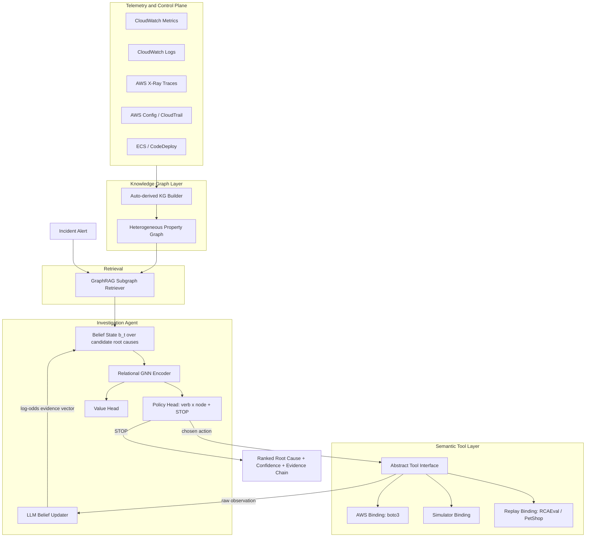
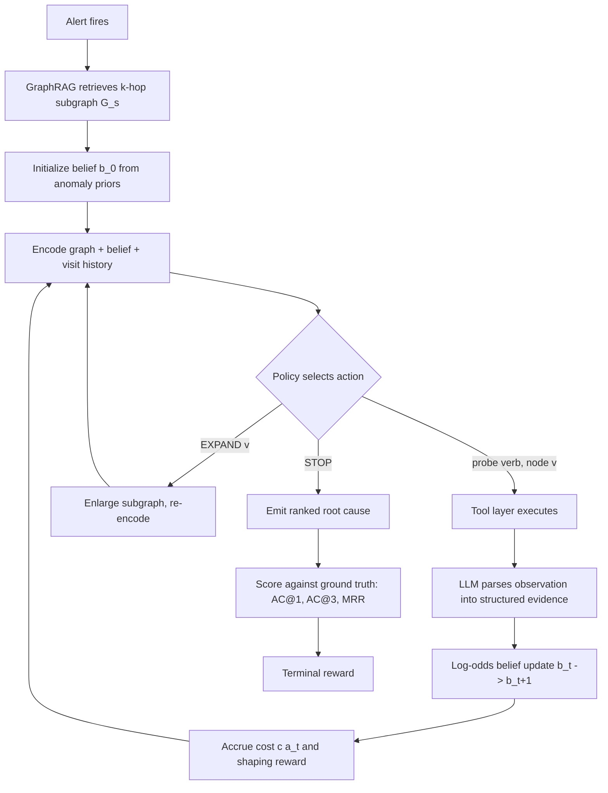
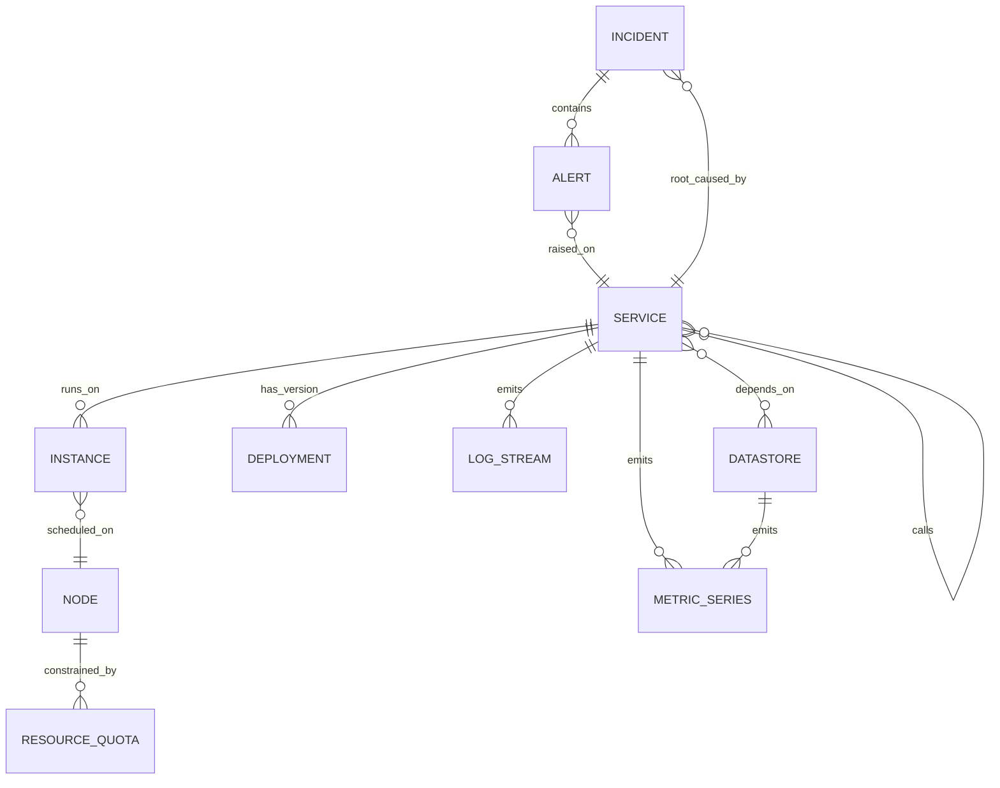
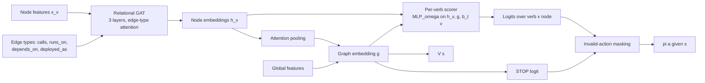
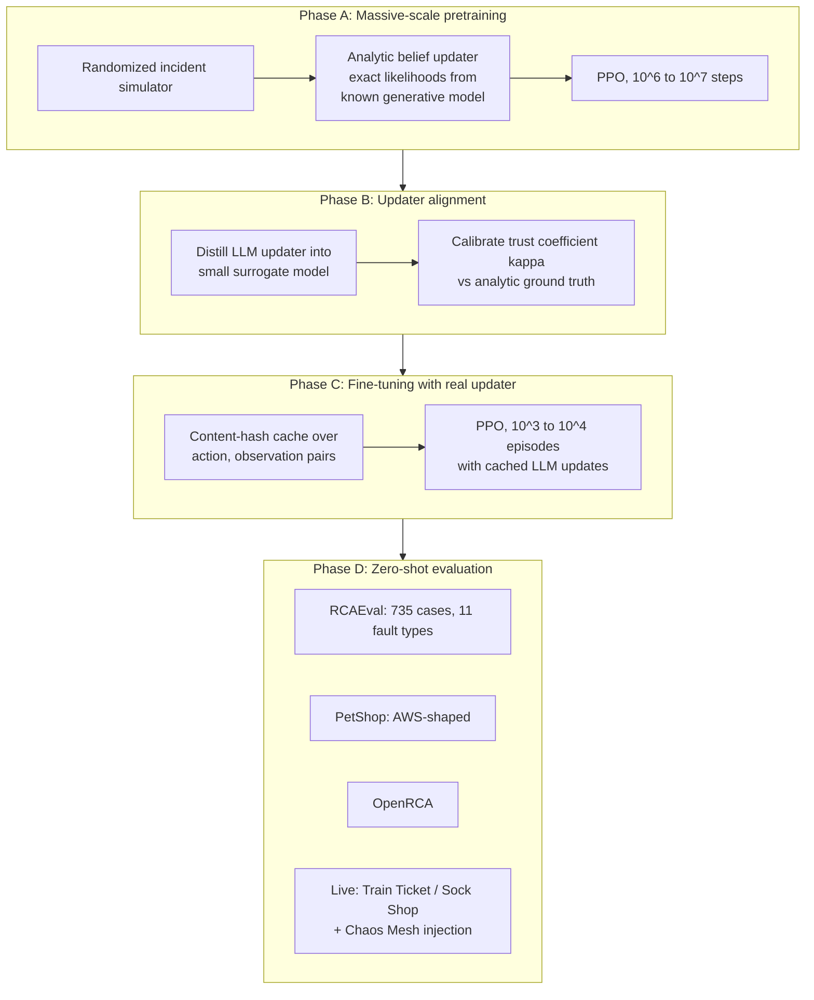
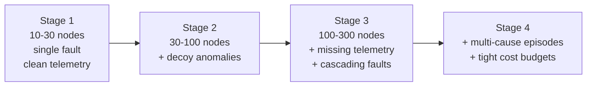
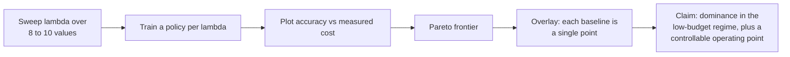
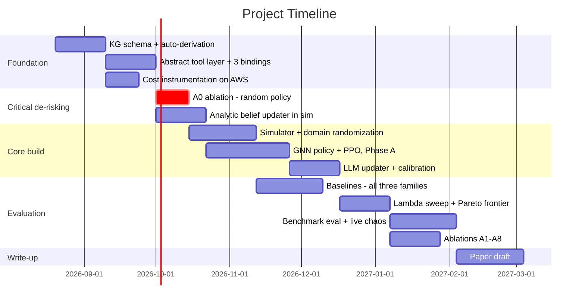

# Cost-Constrained Value-of-Information Policies for Autonomous Cloud Root Cause Analysis

**Design and Proposed Methodology**

Working title: *Learning to Investigate: Cost-Aware Value-of-Information Policies for LLM-Assisted Root Cause Analysis*

---

## 0. Positioning statement

Existing LLM-agent RCA systems (RCAgent, Flow-of-Action, LATS-RCA, RCACopilot) plan by prompting. They optimize *whether* the root cause is found, never *how much it cost to find it*. ThinkFL and hierarchical-RLHF approaches introduce RL, but they fine-tune the LLM's own weights to become a better planner.

**Our claim is different and narrower:** root cause analysis is a partially observable sequential experiment. The agent never observes the root cause; it observes evidence about it. The correct object of study is therefore not "a better prompt" and not "a better fine-tuned LLM," but **an amortized policy for cost-constrained Bayesian experimental design over a dependency graph**, with the LLM demoted to a well-defined, replaceable role: belief updating from unstructured telemetry.

Three consequences that make the RL component load-bearing rather than decorative:

1. Probes have **delayed and correlated payoffs** — inspecting a deployment is worthless unless you later inspect the downstream error rate. A myopic one-step information-gain heuristic cannot represent this. A learned policy can.
2. The action space is **combinatorial over graph nodes**, not a fixed set of five verbs, so the policy must generalize across topologies it has never seen.
3. The accuracy/cost tradeoff is a **tunable parameter**, so the output is a Pareto frontier — a result no prompt-based planner can produce at all.

---

## 1. Formal problem definition

### 1.1 The POMDP

An incident is an episode of the POMDP $\mathcal{M} = \langle \mathcal{S}, \mathcal{A}, \mathcal{O}, T, Z, R, \gamma \rangle$.

| Element | Definition |
|---|---|
| Hidden state $s$ | $s = (v^\*, \phi, \theta)$ — true root cause node $v^\* \in V$, fault type $\phi \in \Phi$, latent propagation parameters $\theta$ |
| Observable graph | $G_s = (V_s, E_s)$ — the GraphRAG-retrieved subgraph around the alerting resource |
| Belief | $b_t \in \Delta(V_s \times \Phi)$ — posterior over (root cause node, fault type) given history $h_t$ |
| Action $a_t$ | $\mathcal{A} = \{(\omega, v) : \omega \in \Omega,\ v \in V_s\} \cup \{\texttt{EXPAND}(v)\} \cup \{\texttt{STOP}\}$ |
| Verbs $\Omega$ | `metrics`, `logs`, `traces`, `deploy_history`, `config_diff`, `dependency_health`, `resource_limits` |
| Observation $o_t$ | Raw tool return from the AWS/telemetry layer |
| Belief update $Z$ | $b_{t+1} = U(b_t, a_t, o_t)$ — LLM-mediated, log-odds form (§4.3) |
| Reward $R$ | Cost penalty per step, accuracy payoff at termination (§4.4) |

**Why POMDP and not MDP.** The true root cause is never directly returned by any tool. Every action yields evidence with non-trivial likelihood, and the agent's job is to reduce posterior entropy over $v^\*$ fast enough to justify the money spent. Framing this as an MDP over "investigation history" hides exactly the structure that makes the problem interesting.

### 1.2 The objective

$$
\pi^\* = \arg\max_\pi\ \mathbb{E}\left[\underbrace{\mathcal{A}(b_T, v^\*)}_{\text{terminal accuracy}} - \lambda \sum_{t=0}^{T-1} c(a_t)\right]
$$

where $c(a)$ is the *measured* cost of action $a$ in normalized units, and $\lambda$ is the price of accuracy in cost units. **$\lambda$ is swept, not tuned.** The deliverable is the frontier $\{(\text{cost}(\lambda), \text{accuracy}(\lambda))\}$.

---

## 2. System architecture



**Note the two deliberate decouplings.** The LLM sits *only* on the observation-to-belief edge, never on the action-selection edge. And the tool layer is an abstract interface with three interchangeable bindings, so the same policy runs against a simulator, a replayed benchmark, or live AWS without code changes. This is what turns a systems project into a methods paper.

---

## 3. The decision loop



**The single most important change from the original design:** `STOP` is an action of the *policy*, not a verdict of the LLM. In the original flowchart the LLM answered "root cause found?", which meant the LLM controlled episode length — and episode length is the dominant cost driver. Any efficiency claim would have been measuring the LLM, not the policy. The LLM now emits only a calibrated confidence signal that enters the state; the policy decides whether that confidence is worth the next probe.

---

## 4. Component design

### 4.1 Knowledge graph schema

Auto-derived, not hand-authored. This matters for credibility — "assume a knowledge graph exists" is a reviewer target.



| Source | Derives |
|---|---|
| AWS Config + resource tags | `SERVICE`, `INSTANCE`, `NODE`, `DATASTORE` nodes and ownership edges |
| X-Ray service map | `calls` edges with latency and error-rate weights |
| CodeDeploy / ECS task definitions | `DEPLOYMENT` nodes, version edges, deploy timestamps |
| CloudWatch metric namespaces | `METRIC_SERIES` attachment |
| VPC flow logs (optional) | Network-adjacency edges for latency faults |
| Historical incident records | `INCIDENT` nodes — used as belief priors, not as training labels |

### 4.2 State representation

The state fed to the policy is **structured and LLM-free**. Raw LLM text never enters the gradient path — this is what keeps the MDP stationary and reproducible across model versions.

Per-node feature vector $x_v \in \mathbb{R}^d$:

| Group | Features |
|---|---|
| Belief | $b_t(v)$, marginal over fault types at $v$, rank of $v$ in $b_t$ |
| Anomaly | z-scores per metric family (CPU, mem, latency, error rate, saturation), max abs z, count of breached thresholds |
| Topology | hops from alerting node, in/out degree, betweenness within $G_s$, is-leaf, is-datastore |
| Provenance | deploy recency, config change recency, instance age, co-tenancy count |
| History | per-verb visited mask (a 7-bit vector), steps since last visit, cumulative cost spent on $v$ |
| Evidence | scalar evidence strength returned by the LLM updater for $v$, confidence of that update |

Global features $g$: elapsed cost fraction $\sum c / B$, steps taken, belief entropy $H(b_t)$, entropy delta over last 3 steps, subgraph size.

### 4.3 The LLM as belief updater

The LLM's contract is deliberately tiny and schema-constrained:

```
INPUT:  action taken, raw observation, current top-k candidates with priors
OUTPUT: {
  "evidence": [{"node_id": str, "log_likelihood_ratio": float in [-4, 4],
                "fault_type": str, "rationale": str}],
  "observation_informativeness": float in [0, 1]
}
```

Belief update in log-odds form, which is stable and lets a single bad LLM call be bounded:

$$
\log b_{t+1}(v) \propto \log b_t(v) + \kappa \cdot \ell_t(v), \qquad \kappa \in (0,1]
$$

$\kappa$ is a *trust* coefficient, calibrated on a held-out set against the simulator's true likelihoods. It is the knob that stops a confidently wrong LLM from collapsing the posterior.

**Reproducibility discipline:** pin the model version, temperature 0, log every prompt-response pair with a content hash. A hosted-model version bump silently changes your transition kernel otherwise.

### 4.4 Reward function

$$
r_t = \underbrace{-\lambda\, c(a_t)}_{\text{cost}} + \underbrace{\gamma\Phi(b_{t+1}) - \Phi(b_t)}_{\text{shaping}}, \qquad
r_T = \mathcal{A}(b_T, v^\*)
$$

**Cost model**, measured not assumed — instrument every real call once and fit a table:

$$
c(a) = w_\$ \cdot \text{USD}(a) + w_\tau \cdot \text{seconds}(a) + w_\kappa \cdot \text{tokens}(a)
$$

Log queries over wide time windows genuinely cost 10–50× a metric `GetMetricStatistics` call. Reporting this table is itself a small contribution — nobody publishes it.

**Terminal accuracy**, giving partial credit so the gradient is not brutally sparse:

$$
\mathcal{A}(b_T, v^\*) = \alpha \cdot \mathbb{1}[\text{top-1} = v^\*] + \beta \cdot \text{MRR}(v^\*, b_T) + \eta \cdot \mathbb{1}[\hat\phi = \phi^\*] - \rho \cdot \mathbb{1}[\text{premature stop}]
$$

**Shaping potential** $\Phi(b) = -H(b)$, negative posterior entropy. Because this is potential-based (Ng et al., 1999), it provably does not change the optimal policy — it only densifies the learning signal. State this in the paper; it preempts "your shaping biases the result."

### 4.5 Policy network



Key properties:
- **Permutation-equivariant and size-agnostic.** The same weights run on a 12-node and a 400-node subgraph. This is what makes zero-shot transfer to unseen topologies even conceivable.
- **Invalid-action masking** for already-probed (verb, node) pairs and nodes lacking a given telemetry type. Non-negotiable for PPO stability with large $|\mathcal{A}|$.
- Algorithm: **PPO** with GAE, entropy bonus annealed. Fallback if sample efficiency bites: **IQL** on logged trajectories.

---

## 5. Training methodology

### 5.1 The LLM-in-the-loop problem, and how we get around it

PPO needs $10^6$–$10^7$ environment steps. An LLM belief update per step is financially and temporally impossible. This is the project's #1 engineering blocker and must be designed around explicitly.



Phase A is the load-bearing trick: **inside the simulator we know the generative model**, so we can compute exact Bayesian belief updates and train the policy against the *idealized* updater. The LLM is only ever asked to approximate that updater at evaluation time, and Phase B measures how badly it fails.

### 5.2 Simulator design — and the discipline it requires

The obvious failure mode is writing a fault propagation model and then training a policy that learns *your model's quirks* rather than cloud physics. Mitigation is aggressive **structural** domain randomization — randomize the propagation model itself, not just its parameters:

| Randomized | Range |
|---|---|
| Topology | 10–300 services; scale-free, layered, and hub-and-spoke generators |
| Propagation delay | log-normal, per-edge, $\mu$ and $\sigma$ resampled per episode |
| Attenuation function | linear / saturating / threshold — **sampled per episode from a family** |
| Telemetry noise | heteroscedastic; SNR from 0.5 to 20 |
| Missing telemetry | 0–40% of nodes lack traces or logs entirely |
| Alert delay & false alarms | 0–5 min; 0–3 decoy anomalies unrelated to $v^\*$ |
| Fault types | The 6 classes from the original abstract, plus multi-cause episodes |

**Held-out propagation families.** Train on linear + saturating attenuation; test on threshold. If the policy collapses, you have learned the simulator, and you report that honestly — it is a finding, not a failure.

### 5.3 Curriculum



Advance a stage when AC@1 on the current stage's held-out set plateaus for 3 consecutive evaluations.

---

## 6. Experimental design

### 6.1 Baselines — three families, all mandatory

| Family | Method | What it tests |
|---|---|---|
| **LLM planners** | ReAct with tools | The literature default |
| | **ReAct + explicit cost budget in prompt** | *The honest baseline.* Vanilla ReAct is a strawman; a prompted budget is what a competent engineer would actually do |
| | Flow-of-Action style SOP agent | Structured prompt planning |
| | ThinkFL (if reproducible) | RL-fine-tuned LLM planner — the closest prior work |
| **Non-learned policies** | Random valid action | The killer ablation (§6.3) |
| | Greedy max-anomaly-score | Trivial heuristic |
| | BFS from alert node | Topology-only |
| | **Myopic one-step VoI** | *The critical comparator.* Isolates whether non-myopia is what RL buys |
| **Classical RCA** | BARO, CIRCA, RCD, MicroRCA, RCD | A decade of prior work. Omitting this family reads as ignorance |

### 6.2 Metrics

**Accuracy:** AC@1, AC@3, AC@5, MRR, Avg@5 (RCAEval convention), fault-type accuracy.

**Cost:** tool invocations, AWS API calls, LLM input/output tokens, USD, wall-clock time-to-root-cause.

> Rename **MTTR → TTRC**. MTTR conventionally means Mean Time To *Repair*; reviewers will flag the collision immediately.

**Primary result — the frontier, not a single number:**



Also report **accuracy at fixed budget** $B \in \{5, 10, 20, 40\}$ actions — this is the operationally meaningful number and the one that most favors the method.

**Statistical protocol:** 5 seeds per configuration; report mean ± 95% CI; paired per-case scoring against baselines. **Report per-subsystem, never pooled** — a 2026 audit of OpenRCA/RCAEval/PetShop found that pooled top-1 accuracy hides sign-flipping subsystem-level effects, with leave-one-system-out selection picking the worse method on up to 5 of 11 held-out subsystems.

### 6.3 Ablations

| ID | Ablation | Question it answers |
|---|---|---|
| **A0** | Random policy + same LLM reasoner | **Run this first, before anything else.** If the LLM alone nearly matches with modestly more steps, the contribution is a constant factor — better to know in month 2 than at review |
| A1 | Myopic VoI instead of learned policy | Is non-myopia what RL actually buys? |
| A2 | Flat 5-verb action space, no node parameterization | Isolates the graph-parameterized action space contribution |
| A3 | $\lambda = 0$ (no cost term) | Isolates cost-awareness |
| A4 | MLP encoder instead of relational GNN | Does graph structure help, or just features? |
| A5 | No GraphRAG — full graph | Is retrieval necessary or merely convenient? |
| A6 | No shaping ($\Phi \equiv 0$) | Sample-efficiency contribution of shaping |
| A7 | LLM updater vs analytic updater | Quantifies the belief-update approximation gap |
| A8 | LLM-decided STOP vs policy STOP | Directly measures the flowchart fix from §3 |

### 6.4 Threats to validity — state these in the paper before a reviewer does

| Threat | Mitigation |
|---|---|
| Policy learns simulator quirks | Held-out propagation families; zero-shot benchmark eval; report the drop honestly |
| LLM version drift changes the transition kernel | Pinned model, temp 0, hashed prompt/response logs |
| Cost model is arbitrary | Costs measured empirically on live AWS; sensitivity analysis over $w$ weights |
| Small action space makes RL unnecessary | Node-parameterized actions; ablation A2 |
| Single-seed RL results | 5 seeds, CIs, paired tests |
| Benchmarks favor certain methods | Per-system reporting; three benchmark families |

---

## 7. Contributions, stated for a reviewer

1. **Formulation.** Cloud RCA as a cost-constrained POMDP over a dependency graph, with the policy solving an amortized value-of-information problem — distinguished explicitly from RL-fine-tuning of the LLM planner (ThinkFL) and from prompt-based planning (RCAgent, Flow-of-Action).
2. **Graph-parameterized semantic action space** with a permutation-equivariant relational-GNN policy that transfers zero-shot across unseen topologies.
3. **Decoupled belief update**, keeping the LLM off the gradient path — yielding a stationary MDP, a swappable LLM, and a measurable approximation gap (A7).
4. **A measured cost model** for cloud investigation actions, and an accuracy–cost **Pareto frontier** as the primary result rather than a single accuracy number.
5. **Empirical evaluation** across three standardized benchmark families plus live chaos-injected microservices, with per-system reporting.

---

## 8. Milestones



**Milestone b1 is a go/no-go gate.** Run the random-policy ablation before building the simulator. If a random probe order plus the LLM reasoner already achieves acceptable accuracy at acceptable cost, the whole thesis needs to shift toward harder regimes — very large topologies, tight budgets, multi-cause incidents, heavy telemetry gaps — where the gap actually exists. Discovering that in week 6 is cheap; discovering it in month 9 is not.

---

## 9. Open design decisions to settle early

1. **Multi-cause episodes** — does $b_t$ stay a distribution over single nodes, or become a distribution over *sets*? The latter is more realistic and much harder. Recommend: single-cause for the main result, multi-cause as an extension section.
2. **`EXPAND` semantics** — should subgraph expansion be a policy action with its own cost, or automatic? Making it an action is more principled and gives a nice qualitative result: the learned policy should expand *late*, only when the local belief has flattened.
3. **Offline data.** If any real SRE investigation traces are obtainable, IQL/CQL pretraining on them would substantially strengthen the sim-to-real story. Worth asking early; likely unavailable.
4. **PPO vs GRPO.** If Phase C proves unstable, GRPO's group-relative advantage removes the value-function burden and is well-suited to the sparse terminal-reward structure here.
