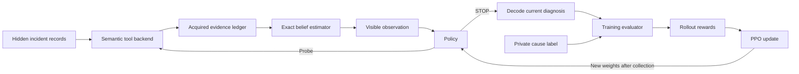

# Small simulator: RL setup, training, and validation plan

Prepared on 13 September 2026.

This plan turns the proposed small simulator into a concrete build sequence. It is the next step after [the implementation review](./RL_Implementation_Review_and_Plan.md). It requires no AWS account, collected telemetry, graph database, LLM, or work from the telemetry/graph teammate.

This document specifies work to execute next. The simulator, training modules, and experiment commands described here have not been implemented or run. The probabilities and costs below are explicit initial assumptions. We will revise them using development results and preserve each configuration so the comparisons remain interpretable.

## 1. What we will establish

The first objective is to show that the environment and training code work. The second is to measure whether the policy learns useful investigation behavior.

We should be able to answer these questions after the first experiment:

- Does the agent choose informative probes instead of querying arbitrary services?
- Does it select a broad query when the additional evidence is worth the additional cost?
- Does it stop when the remaining evidence is too expensive or unhelpful?
- Does its behavior change appropriately when its budget changes?
- Can we explain a failure by inspecting the incident, observations, posterior, actions, and rewards?

Success in this simulator will validate our RL implementation. It will not establish AWS diagnosis accuracy or real-world cost savings. Those require a later environment with realistic evidence and measured tool costs.

Read [the simulator specification](#4-define-the-hidden-incident-world) and [belief update](#6-implement-the-exact-diagnostic-estimator) before writing the environment. The [execution sequence](#12-execute-the-experiments-in-this-order) gives the run order. The [adjustment rules](#15-how-to-change-parameters-after-seeing-results) explain what to change when a run disappoints.

## 2. The exact first configuration

Use one small, fixed specification before introducing a curriculum or an experiment sweep.

| Parameter | Initial value |
|---|---|
| Services per incident | 8 |
| Maximum supported padded services | 10 |
| Topology | A generated rooted directed acyclic graph |
| Root cause | One service, uniformly sampled |
| Fault types | CPU saturation, memory exhaustion, network delay |
| Fault prior | Uniform over the three types |
| Hidden background workload | Normal or busy, equally likely |
| Tools | Metrics and logs |
| Presets per tool | Quick and detailed |
| Query costs | Metrics quick 1, metrics detailed 2, logs quick 2, logs detailed 4 |
| Episode budget | 8 synthetic credits |
| Maximum probes | 6, excluding STOP |
| Cost penalty | lambda_cost = 0.05 |
| Terminal utility | 1 for the correct service, otherwise 0 |
| Discount | gamma = 1 |
| Reward shaping | Off |
| Policy | Small shared candidate-scoring network |
| Training algorithm | PPO with a critic and GAE |
| LLM and AWS calls | None |
| Compute | CPU first |

These limits are smaller than the broader review's illustrative configuration. Six probes and eight services make traces readable and bugs easier to reproduce. We can increase them after validation.

The action costs are experimental credits. Do not label them dollars or interpret the simulator's runtime as cloud-query latency. All costs are known exactly in this version, so a strict credit budget is possible.

Keep the first task closed-set. The cause is always one of the listed services and one of the three supported faults. Do not add UNKNOWN, false alarms, multiple causes, or graph expansion yet. Those require additional labels and decision rules.

The component boundaries should look like this:



Forced termination also decodes and scores the diagnosis. The evaluator is the only component that compares the prediction with the private label. The diagram omits bookkeeping such as masks and costs, which the environment handles on every transition.

## 3. Prepare the local development environment

### 3.1 Current workspace findings

The project currently contains Markdown documents and no simulator source. The shell has `uv` and the Windows `py` launcher. During this planning pass, `uv --version` reported 0.11.30, while `py -0p` reported no installed Pythons. This does not rule out a separate application-bundled runtime, but it means we should provision an explicit project interpreter instead of relying on `python` being on PATH.

Use Windows and PowerShell for this phase. Bash becomes relevant when we add the AWS executor; it is unnecessary for an in-memory simulator.

### 3.2 Install a project interpreter and dependencies

Use Python 3.12 and an isolated environment managed by uv. The exact Python patch version and resolved library versions must be recorded when setup runs. uv can obtain a requested interpreter and create the local environment. [uv environment documentation](https://docs.astral.sh/uv/pip/environments/).

First write a `pyproject.toml` with this structure:

```toml
[project]
name = "rca-sim"
version = "0.1.0"
requires-python = ">=3.12,<3.13"
dependencies = [
  "numpy",
  "gymnasium",
  "torch",
  "pyyaml",
  "pandas",
  "matplotlib",
]

[dependency-groups]
dev = ["pytest"]

[build-system]
requires = ["hatchling"]
build-backend = "hatchling.build"

[tool.hatch.build.targets.wheel]
packages = ["src/rca_sim"]

[tool.uv.sources]
torch = { index = "pytorch-cpu" }

[[tool.uv.index]]
name = "pytorch-cpu"
url = "https://download.pytorch.org/whl/cpu"
explicit = true
```

Create `src/rca_sim/__init__.py` before installing the local package. Then run the following from the project root during implementation:

```powershell
uv python install 3.12
uv python pin 3.12
uv sync
uv run --locked python -c "import sys, torch, gymnasium; print(sys.version); print(torch.__version__); print(gymnasium.__version__); print(torch.rand(2, 2))"
```

The package names above are unpinned only for the initial resolution. Preserve `uv.lock` immediately afterward and use `--locked` for subsequent commands. Record the interpreter's exact version in the run metadata. If the initial resolver finds incompatibilities, solve them before training and retain the working lockfile. [uv locking and syncing](https://docs.astral.sh/uv/concepts/projects/sync/).

The explicit CPU index keeps the initial PyTorch install focused on CPU execution. Check the official installation guidance when choosing a GPU build later. [uv PyTorch integration](https://docs.astral.sh/uv/guides/integration/pytorch/), [PyTorch installation](https://pytorch.org/get-started/locally/).

Do not install a graph neural-network library, cloud SDK, LLM SDK, or distributed training framework yet. NumPy is sufficient for the tiny simulator, and the first policy does not require graph convolutions.

### 3.3 Create the source layout

```text
Project1/
  pyproject.toml
  uv.lock
  .python-version
  .gitignore
  configs/
    sim_v0.yaml
    ppo_v0.yaml
    fixtures.yaml
  src/rca_sim/
    __init__.py
    config.py
    contracts.py
    graph.py
    likelihoods.py
    world.py
    tools.py
    evidence.py
    belief.py
    observation.py
    environment.py
    baselines.py
    oracle.py
    model.py
    rollout.py
    ppo.py
    metrics.py
    make_cases.py
    inspect_case.py
    validate.py
    train.py
    evaluate.py
    report.py
  tests/
    test_graph.py
    test_likelihoods.py
    test_belief.py
    test_tools.py
    test_environment.py
    test_policy.py
    test_rollout.py
    test_fixtures.py
  cases/
  runs/
```

Keep `.venv/`, `__pycache__/`, and temporary outputs out of version control. Keep the specifications, test fixtures, split manifests, dependency lock, and small evaluation summaries. Save model artifacts with their run metadata even if large checkpoints live outside version control.

The responsibility of each module should remain narrow. `world.py` owns hidden truth. `belief.py` sees public likelihoods and acquired evidence. `environment.py` handles the investigation. `model.py` sees only policy observations. `ppo.py` updates the network from stored transitions.

Done means the interpreter works, dependencies import, and an empty test run can discover the package. No training is needed to finish this step.

## 4. Define the hidden incident world

### 4.1 Generate a dependency graph

An edge `u -> v` means service u calls service v. A failure at v can therefore produce symptoms in u. Keep that direction consistent everywhere.

For the first graph generator:

1. Create N services in a temporary topological order.
2. Make service 0 the entry service where investigation requests arrive.
3. For every later service j, choose one parent uniformly from services 0 through j-1 and add `parent -> j`.
4. For every remaining forward pair i < j, add an extra edge independently with probability 0.15.
5. Compute directed shortest-path distances and node degrees.
6. Apply a uniformly random permutation to the public node order and IDs. Remap edges, entry-service identity, and all internal references consistently.

The parent links ensure that every service is reachable from the entry service. Forward edges prevent cycles. The permutation stops service index from acting as a root-cause shortcut.

A graph library is optional at this size. An adjacency matrix and breadth-first search are enough. The public topology contains edges only; it does not contain hidden incident-specific latency or fault labels.

Test a chain, a branching tree, and a graph with shared dependencies before trusting the random generator. Verify that a failure at a dependency marks its callers as possible symptom carriers, rather than propagating in the wrong direction.

### 4.2 Sample one cause and one workload condition

After generating the graph, sample:

```text
cause_service ~ Uniform(all N services)
fault_type ~ Uniform(cpu, memory, network_delay)
workload ~ Bernoulli(0.5), with 0 = normal and 1 = busy
```

The full hidden hypothesis is a tuple of service, fault, and workload. At N = 8, it has 8 * 3 * 2 = 48 possible values.

The workload variable creates correlations between observations. A busy system can produce mildly elevated readings on several services, so seeing one high CPU value should not automatically identify the cause.

The entry-service alert is a task trigger that appears for every sampled hypothesis. Its visible content gives the entry service and a fixed incident window, not another independently sampled diagnostic result. Therefore the initial prior remains uniform. Do not filter episodes by a randomly sampled alert metric unless the posterior model also accounts for that selection.

This is a conditional diagnostic benchmark: we already know an incident exists. We are not training an anomaly detector or claiming these probabilities reproduce a physical cloud system.

### 4.3 Give every service a relationship to the cause

For a candidate hidden cause c and observed service v:

- v is the cause when v = c.
- v is an affected caller when there is a directed path from v to c. Its distance d is the shortest such path.
- Otherwise v is unrelated in this first propagation model.

This includes an intentional simplification. We model symptoms spreading from a failed dependency to callers. We do not yet model faulty callers overloading their dependencies, host contention, or cyclic calls.

Keep this classification in one function shared by the simulator and likelihood calculator. A mismatch between them would make the supposedly exact estimator wrong.

### 4.4 Generate synthetic metric observations

Each service has three diagnostic metric categories: CPU high, memory high, and latency high. Each value is binary. These are coarse summaries that a future parser could derive from real metric arrays.

For normal workload, use these probabilities:

| Service relationship and fault | P(CPU high) | P(memory high) | P(latency high) |
|---|---:|---:|---:|
| Cause, CPU fault | 0.85 | 0.15 | 0.75 |
| Cause, memory fault | 0.15 | 0.85 | 0.75 |
| Cause, network delay | 0.15 | 0.15 | 0.90 |
| Affected caller at distance d | 0.10 | 0.10 | 0.15 + 0.55 * 0.7^(d-1) |
| Unrelated service | 0.10 | 0.10 | 0.15 |

For busy workload, add 0.10 to the CPU and memory probabilities and 0.05 to the latency probability. Cap all probabilities at 0.95.

For each service and metric category, sample two persistent readings, indexed 0 and 1, independently conditional on the full hidden hypothesis. For eight services, that is 8 * 3 * 2 = 48 binary metric records per incident.

The same cause may therefore produce an unremarkable sample, and an unrelated node may occasionally look bad. That uncertainty is intentional. The learner must combine evidence rather than find a perfect fault flag.

These values are initial engineering choices. Before tuning PPO, we will measure how well the exact estimator can diagnose incidents under this model.

### 4.5 Generate synthetic log observations

Use four log categories in this fixed order:

```text
0 = no relevant error
1 = resource pressure
2 = timeout
3 = other error
```

For normal workload, start with:

| Relationship and fault | No relevant error | Resource pressure | Timeout | Other error |
|---|---:|---:|---:|---:|
| Cause, CPU or memory | 0.10 | 0.65 | 0.15 | 0.10 |
| Cause, network delay | 0.10 | 0.10 | 0.70 | 0.10 |
| Direct affected caller | 0.25 | 0.10 | 0.55 | 0.10 |
| Unrelated service | 0.75 | 0.05 | 0.10 | 0.10 |

For a caller at distance d, mix the direct-caller distribution with the unrelated distribution:

```text
caller_distribution = 0.7^(d-1) * direct_caller_distribution
                      + (1 - 0.7^(d-1)) * unrelated_distribution
```

For busy workload, mix the resulting distribution with a fixed busy-background distribution:

```text
busy_background = [0.25, 0.35, 0.30, 0.10]
final_distribution = 0.85 * normal_distribution + 0.15 * busy_background
```

For normal workload, use the normal distribution unchanged. Every row must sum to one. Sample three persistent log categories per service, independently conditional on the full hidden hypothesis. That gives 24 log records for an eight-service incident.

CPU and memory causes deliberately have the same log distribution. Logs may help locate resource pressure, while metrics distinguish its type. Caller timeouts may indicate a failing dependency rather than a failure in the caller itself.

Display readable text from these categories if useful, such as `request to dependency timed out`. The policy consumes the structured categories. Do not include hidden cause names or extra diagnostic details in the generated text.

### 4.6 Freeze all records at reset

Generate the full incident once. Tools reveal subsets of these records. They do not resample them.

Assign stable evidence IDs such as:

```text
metrics/service-3/cpu/0
metrics/service-3/latency/1
logs/service-3/0
```

Repeated reads return the same evidence ID and value. Query order must not affect any other unseen record. Store enough information to replay an incident exactly from its seed and generator version, or serialize the complete hidden fixture for development cases.

Given the complete hidden hypothesis, the records are independent in this version. After marginalizing over the unknown cause and workload, observations can be correlated. That distinction is what permits exact inference without falsely treating all observed symptoms as independent.

## 5. Define semantic tools and action behavior

### 5.1 Implement four probe templates

| Template | Records returned for the chosen service | Cost |
|---|---|---:|
| `metrics.quick` | Reading 0 for CPU, memory, and latency | 1 |
| `metrics.detailed` | Readings 0 and 1 for all three metrics | 2 |
| `logs.quick` | Log record 0 | 2 |
| `logs.detailed` | Log records 0, 1, and 2 | 4 |

The presets represent narrow and broad evidence acquisition. Do not call them five-minute and fifteen-minute windows yet, because this simulator does not generate time series. Later, retain the preset concept and map it to actual query windows and limits.

The detailed action may reveal a mix of previously seen and new evidence. If `metrics.quick` was already executed, a detailed query still costs 2 credits, returns the original reading 0 and new reading 1, and updates the belief only from the new records. Total spending becomes 3 credits. This creates a real scope decision: committing to detail immediately is cheaper than upgrading after a quick query, but the quick result might have been enough.

Initially every service supports both tools, every successful tool returns complete results, and execution has no random failure. Missing telemetry and failures are later stress tests.

### 5.2 Keep a stable action-index mapping

Use four templates per padded service slot and one STOP slot:

```text
template 0 = metrics.quick
template 1 = metrics.detailed
template 2 = logs.quick
template 3 = logs.detailed

action_index = 4 * service_slot + template_index
STOP = 4 * N_max = 40
action_space = Discrete(41)
```

With eight active services, only 32 probe slots can initially be valid. The eight slots for padded services are masked. STOP stays at index 40 for all supported graph sizes.

The shared neural scorer still treats these as semantic candidates; it does not learn a separate unrelated output weight for each service slot. This fixed encoding makes batching and Gymnasium integration easier while we support only 6 to 10 services.

### 5.3 Construct the action mask

A probe is valid if its service exists, its tool is available, its cost fits the remaining credits, and it would reveal at least one unseen evidence record. STOP is always valid before termination.

This rule masks a quick query after its corresponding detailed query. It also masks exact repeats. The rule uses evidence coverage and public costs, not whether unseen evidence would be useful.

If a caller passes an invalid action, raise an explicit error before changing the incident, evidence, or budget. During training, an invalid sampled action is a software defect. Do not silently substitute STOP or turn it into a learnable penalty.

### 5.4 Define a backend-neutral result

```json
{
  "action": {
    "tool": "metrics",
    "target_id": "service-3",
    "preset": "quick"
  },
  "status": "ok",
  "evidence": [
    {"id": "metrics/service-3/cpu/0", "kind": "cpu_high", "value": 1},
    {"id": "metrics/service-3/memory/0", "kind": "memory_high", "value": 0},
    {"id": "metrics/service-3/latency/0", "kind": "latency_high", "value": 1}
  ],
  "cost": {"credits": 1},
  "coverage": {"complete": true}
}
```

The evidence ledger owns deduplication and rejects an existing evidence ID with a different value. The executor returns evidence, not a diagnosis or a reward. This is the boundary we will retain when the backend later executes AWS commands.

## 6. Implement the exact diagnostic estimator

### 6.1 Maintain the full 48-hypothesis posterior

Let h denote service, fault, and workload. Initialize:

```text
q_0(h) = 1 / (N * 3 * 2)
```

For every newly revealed evidence atom e:

```text
q_next(h) = q(h) * P(e | h, graph)
q_next = q_next / sum(q_next)
```

The probability comes from the exact same metric/log tables used by the generator. For a binary record, use p when its value is 1 and 1-p when its value is 0. For a log record, select its category's probability.

For a batch of new evidence, multiply the likelihoods conditional on h before summing over h. Do not multiply marginal probabilities that have already summed out workload, because that would discard the dependence created by the shared hidden workload.

The estimator knows the list of possible workloads and their probabilities. It does not know the actual sampled workload. Never pass the true cause, fault, workload, seed, or unrevealed records into the estimator's inference call.

### 6.2 Produce the diagnostic quantities

```text
belief_service_fault[v, f] = sum over w of q[v, f, w]
belief_service[v] = sum over f,w of q[v, f, w]
belief_busy = sum over v,f of q[v, f, busy]

predicted_service = argmax_v belief_service[v]
predicted_fault = argmax_f belief_service_fault[predicted_service, f]
```

For ties, use one declared deterministic convention consistently across methods. Node permutations can change which tied service is chosen; invariance tests should compare probabilities or sets of tied optima rather than demand a unique answer when none exists.

The terminal reward only scores the service in this version. Fault accuracy is diagnostic output and an evaluation metric. That avoids mixing two objectives before we know the basic acquisition task works.

### 6.3 Use log-space inference

Store unnormalized log probabilities in float64 and normalize with a stable log-sum-exp operation. Convert policy features to float32 afterward. The main simulator uses strictly positive likelihoods, so it should never produce an impossible observation.

Some deterministic fixtures will deliberately contain zero likelihoods. Handle these as negative infinity in log space. If all hypotheses become impossible, raise an inconsistency error. Do not replace the posterior with a uniform distribution and hide the bug.

Keep a slower reference implementation that recomputes the posterior from the original prior and the complete deduplicated ledger. Test the incremental update against this reference.

### 6.4 A hand-checkable example

For a two-hypothesis test, use equal priors for A and B. Suppose CPU-high evidence has likelihood 0.8 under A and 0.2 under B. After observing CPU high:

```text
P(A | evidence) = 0.8
P(B | evidence) = 0.2
```

Now add a new, conditionally independent record with likelihood 0.25 under A and 0.75 under B:

```text
unnormalized A = 0.8 * 0.25 = 0.20
unnormalized B = 0.2 * 0.75 = 0.15
normalized A = 4/7
normalized B = 3/7
```

Reading either old record again leaves these numbers unchanged. Use this test before investigating any training result.

## 7. Build the visible state and episode rules

### 7.1 Declare the observation tensors

Use a Gymnasium dictionary observation with these fixed shapes:

```text
node_features: float32[10, 42]
node_mask: bool[10]
adjacency: float32[10, 10]
global_features: float32[10]
action_mask: bool[41]
```

The simulator may keep additional evaluator-only fields, but they must never enter this dictionary. Construct fresh observation arrays rather than handing the policy references to mutable internal state.

The 42 node features are:

| Features | Count | Encoding |
|---|---:|---|
| Is entry/alert service | 1 | 0 or 1 |
| In-degree and out-degree | 2 | Divide each by 9 |
| Distance from entry | 1 | Directed distance divided by 9 |
| Marginal cause-service probability | 1 | b(v) |
| Fault probabilities conditional on this service | 3 | P(fault type given service v and acquired evidence) |
| Metric values | 6 | Three categories, two readings each; zero for unseen values |
| Metric presence masks | 6 | Distinguish unseen values from observed zero |
| Log values | 12 | Three records, each encoded with four category bits |
| Log presence masks | 3 | Unseen log slots have zero category bits and a zero presence bit |
| Tool availability | 2 | Metrics/logs supported; both initially one |
| Executed-template flags | 4 | Whether each of the four templates was executed |
| Credits spent on this service | 1 | Divide by the initial episode budget |
| Total | 42 | Fixed column order in a schema constant |

Use the evidence presence masks to derive coverage, including coverage obtained through a detailed query. An executed-template flag means the action actually happened; it does not mean all covered templates were individually executed.

The ten global features are:

1. Initial budget divided by 16.
2. Remaining credits divided by 16.
3. Remaining credits divided by initial budget.
4. Remaining probes divided by the configured maximum probes.
5. Entropy of the service/fault belief divided by log of the active service/fault hypothesis count.
6. Largest marginal service probability.
7. Difference between the largest and second-largest service probabilities.
8. Posterior probability of busy workload.
9. Active service count divided by 10.
10. lambda_cost divided by 0.20.

These scales support the first planned sweeps. Record them in the observation schema. If later configurations exceed those ranges, update the declared Gymnasium bounds and schema version rather than silently clipping information. Require at least two active hypotheses or define singleton entropy explicitly as zero.

Give padded nodes all-zero features and mask them out of every pooling operation. Do not include the incident seed, cause label, true workload, or unused evidence arrays. The policy receives the actual acquired observations and probabilities inferred from them, not the simulator's answers.

### 7.2 Define reset precisely

`reset(seed=..., options=...)` should:

1. Initialize a reproducible environment RNG.
2. Generate or load the graph and hidden incident.
3. Empty the evidence ledger and executed-action history.
4. Initialize the full posterior to the declared prior.
5. Set the budget to 8 and probes taken to zero.
6. Build the initial observation and mask.
7. Return observation and public metadata.

An evaluation option should load an exact case from a manifest. Do not mix policy exploration randomness with the RNG that created the incident. Otherwise two policies could accidentally receive different worlds because they consumed different random numbers.

For Gymnasium, seed through the base reset implementation and use the resulting environment RNG or deterministic child streams. Its environment interface defines reset and step return contracts. [Gymnasium custom environments](https://gymnasium.farama.org/tutorials/gymnasium_basics/environment_creation/).

### 7.3 Define a probe transition

For a valid probe:

1. Save a copy of the pre-action observation.
2. Execute the semantic template against the frozen record.
3. Charge its exact credit cost.
4. Merge evidence and update the posterior from unseen atoms only.
5. Increment the probe count and execution history.
6. Determine whether the episode must end.
7. Compute reward and build the next observation.

End the episode if the budget reaches zero, the sixth probe completes, or no feasible evidence-revealing probe remains. In that last case, automatically finalize instead of adding a meaningless extra STOP step. Record the reason as `budget`, `horizon`, or `no_probe_available`.

If the episode ends after a probe, score the diagnosis using the updated belief from that probe. This ordering matters.

### 7.4 Define STOP and reward

STOP ends the episode immediately. It costs zero credits and scores the current marginal service prediction. There is no minimum number of probes.

For every transition:

```text
reward = -0.05 * step_cost + terminal * correct_service
```

Only a terminal transition receives the correctness term. The accumulated return is exactly:

```text
episode_return = correct_service - 0.05 * credits_spent
```

Do not reward entropy reduction, visiting new services, matching fault type, writing a plausible explanation, or successful API status. Those additions would complicate our interpretation of the first result.

Examples:

| Outcome | Credits | Return |
|---|---:|---:|
| Correct after quick metrics and detailed metrics on the same service | 3 | 0.85 |
| Correct at the full budget | 8 | 0.60 |
| Wrong at the full budget | 8 | -0.40 |
| Correct immediate STOP | 0 | 1.00 |
| Wrong immediate STOP | 0 | 0.00 |

Under this configuration, returns must fall within [-0.40, 1.00]. A value outside this range is an accounting defect. An immediate guess succeeds with probability 1/8 under the uniform prior before any evidence, so its expected return is 0.125.

Do not terminate when the simulator notices that the current prediction happens to be correct. That would leak the answer through episode length. Only the policy's STOP decision and public resource limits can end an investigation.

### 7.5 Handle termination separately from collection cutoffs

Return `terminated=True` for STOP, budget exhaustion, horizon exhaustion, or no remaining probe. These are actual task outcomes. In the normal environment, return `truncated=False`.

The PPO collector will sometimes stop gathering a batch while an incident is still running. That is not an environment termination. Retain the final observation and bootstrap the critic from it, then continue that incident in the next batch.

If a separate external wrapper forces an interruption, handle its truncation explicitly. Do not turn every timeout into a zero-value terminal state. [Gymnasium time-limit handling](https://gymnasium.farama.org/tutorials/gymnasium_basics/handling_time_limits/).

After termination, reject another step until reset. The environment should score an incident only once.

## 8. Validate the simulator before training

### 8.1 Validate the probability model

Test every metric probability is in [0, 1], every categorical row sums to one within tolerance, and increasing caller distance moves its distribution toward unrelated background behavior.

For selected fixed hidden hypotheses, sample at least 10,000 worlds with the same graph and hypothesis while varying only observation randomness. Check empirical frequencies against the specified probabilities using binomial or multinomial uncertainty. Use a fixed test seed and a conservative tolerance such as five standard errors plus a small numerical margin. Do not use a fixed percentage tolerance that ignores sample size.

Separately test the cause, fault, and workload sampling frequencies. Do not obtain artificial balance by discarding noisy or hard incidents.

### 8.2 Validate inference and evidence handling

The posterior must sum to one, stay nonnegative, and match the reference recomputation. For a fixed set of evidence, changing its insertion order must not change the posterior beyond numerical tolerance.

Query quick then detailed, and compare the final posterior with a detailed-only query on the identical world. The posteriors should match, while costs should differ. Querying an old ID again through the backend must not change the posterior. The environment may mask that duplicate action, but the ledger still needs its own protection.

For shared workload, build a hand-enumerated two-record case. Verify that summing products over workload matches the estimator and differs from the incorrect product of marginal likelihoods. This catches a subtle independence bug.

### 8.3 Build fixtures with known decisions

Fixtures are small controlled environments using the same tool/action contract but explicitly specified likelihoods. They test different parts of the implementation.

Implement fixture mode with an explicit list of valid hidden hypotheses and optional public initial evidence. Keep the same padded observation and action shapes; inactive services or fault types receive zero probability and the appropriate masks. A known-answer fixture must reveal initial evidence that supports its posterior, rather than secretly assigning certainty from the private label.

| Fixture | Construction | Required result |
|---|---|---|
| Known answer | Initial visible evidence determines the service | STOP is optimal |
| One perfect probe | One cheap probe separates two equally likely services | Probe once, then stop |
| Useless evidence | Every observation has the same distribution under every cause | STOP is optimal when costs are positive |
| Duplicate evidence | Several template paths return the same underlying evidence | Re-reading cannot change belief |
| Expensive discriminator | One useful probe has adjustable cost | Its desirability changes at the expected-utility break-even point |
| Scope choice | Detail contains multiple useful records while quick may be sufficient | Optimal scope depends on prior and budget |
| Last-credit evidence | Final affordable probe identifies the cause | Updated diagnosis is scored on that transition |
| No affordable probe | Remaining budget is below all probe costs | Finalize without a negative budget |

Use a two-probe complementarity fixture as well. Let a binary cause determine whether two hidden bits agree. Either bit alone is uniformly random, but observing both identifies the cause. Use a joint hidden-state model for this fixture, not the main simulator's conditional-independence shortcut. One-step information acquisition can stop prematurely here, while a two-step planner should investigate if the pair's total cost is justified.

This fixture verifies that the system can represent a benefit from a sequence. It does not prove that the ordinary synthetic cloud tasks contain enough such structure for PPO to outperform a myopic planner.

### 8.4 Validate masks and hidden-information boundaries

Run at least 10,000 transitions using only randomly sampled valid actions. Require zero mask violations, negative budgets, NaN observations, and duplicate terminal payouts.

Check that padded actions are impossible, the last affordable probe is handled correctly, and STOP remains selectable before termination. Raising an invalid-action error must leave the state unchanged.

Build a label-isolation test. Hold the visible observation and acquired ledger fixed while changing only the private evaluator's ground-truth label. The policy input, action mask, belief update, and unscored diagnosis must remain identical. The final correctness reward may change.

Also test that the outcome of a fixed sequence is identical with and without tracing enabled. Debug logging must not consume the RNG stream that generates observations.

### 8.5 Check Gymnasium compatibility

Run Gymnasium's environment checker on an N = 10 instance with no initial evidence and enough budget to make all 41 actions valid at reset. The checker samples from the declared action space without consulting our mask, so the ordinary padded eight-service configuration can reject its sampled action for a legitimate reason. Check the installed checker's behavior if its implementation changes. [Gymnasium checker source](https://gymnasium.farama.org/_modules/gymnasium/utils/env_checker/).

Then run our mask-aware multi-step validation loop on the actual eight-service configuration, explicitly resetting after termination. The generic checker catches interface problems; the project tests check state-dependent feasibility and diagnostic behavior. Do not weaken invalid-action validation just to make an unmasked random sampler pass.

Do not move to PPO until these checks pass. The expected output is a validation report with passed tests, fixture returns, posterior checks, and several readable traces. It is not a training curve.

## 9. Establish baselines and an exact planning reference

### 9.1 Immediate STOP

Use the initial belief and stop. On the eight-service task with a uniform prior, expected accuracy is 12.5%. Measured finite-sample accuracy will vary. Large deviations call for inspecting class balance, graph generation, and tie handling.

### 9.2 Random acquisition

Sample uniformly among feasible probes, excluding STOP until a declared fixed probe budget or natural resource termination. Evaluate stopping after 1, 2, 4, and 6 probes, subject to credits. Give each stochastic baseline several independent action seeds on the same incident cases.

Also keep a separate random-including-STOP policy as a smoke test. Do not confuse it with the stronger random-order baseline when judging whether PPO adds value.

### 9.3 A scripted investigator

Start with quick metrics at the entry service. Then inspect unvisited downstream services in breadth-first order using quick metrics. Stop when marginal service confidence exceeds a threshold, or when the budget ends. Break ties consistently.

Evaluate thresholds such as 0.60, 0.75, 0.90, and 0.99 on development data. Keep the best development operating points and freeze them before final evaluation. This gives the script a fair stopping rule.

An additional simple policy can probe the highest-belief service using the cheapest action that reveals new records. It is useful for distinguishing improved diagnosis from improved search order.

### 9.4 Exact one-step value of information

Use the known likelihood model to enumerate possible new outputs for every feasible action. Let b be the marginal cause-service belief and q the full posterior including workload.

```text
stop_value = max_v b(v)

one_step_value(a) = -lambda_cost * cost(a)
                   + sum_y P(y | q, a) * max_v b_after(a, y)[v]
```

Choose the best action only when its value exceeds stop_value; otherwise STOP. Ties favor STOP to avoid spending for no expected utility gain.

For an action revealing new records e1 through ek:

```text
P(y | q, a) = sum_h q(h) * product_j P(y_j | h, graph)
```

Only enumerate records that have not already been seen. Known records have fixed values, so they contribute no new uncertainty. A fresh detailed metrics query has at most 64 possible binary outputs. A fresh detailed log query has at most 64 categorical output combinations.

This baseline is exact for the specified model and one-step horizon. It is not the optimal multi-step policy. Keep its inference runtime separate from synthetic action credits when comparing computational cost.

### 9.5 Exact finite-horizon planning on tiny fixtures

For two- or three-service fixtures, compute the best possible expected return recursively:

```text
V(information, budget, probes_left) = max(
    expected utility of STOP,
    max over feasible a of [
        -lambda_cost * cost(a)
        + sum_y P(y | information, a)
                * V(updated_information, budget-cost(a), probes_left-1)
    ]
)
```

When probes_left becomes zero or no probe is feasible, V is the best current terminal utility. Memoize equivalent evidence states, budgets, and remaining horizons. Do not try to exhaustively solve the whole eight-service environment first; branching grows quickly.

Use these fixture optima to check PPO. For example, a trained fixture policy within 0.02 expected return of the exact optimum is a provisional engineering target. If the optimum has tied actions, compare return rather than demand one particular action sequence.

### 9.6 Measure the full-information reference

Give the exact estimator all 72 records from an eight-service incident and score it. This is a diagnostic reference with acquisition limits removed, not a feasible policy under the eight-credit budget.

Because this estimator is Bayes-correct for our synthetic model, full information cannot reduce expected optimal diagnostic accuracy. Individual incidents can still end with a wrong answer, and finite-sample comparisons have noise.

If full-information accuracy barely exceeds the prior, the observation model is too ambiguous for this intended pilot. If a single cheap query almost always identifies the cause, the task may be too easy to demonstrate selective acquisition. Diagnose those conditions before changing PPO settings.

## 10. Implement the small policy network

### 10.1 Use a shared candidate scorer

Start with a shared per-service encoder:

```text
service_features[42]
  -> Linear(42, 64) -> ReLU
  -> Linear(64, 64) -> ReLU
  -> service_embedding[64]
```

Pool the embeddings of active services using masked mean and masked maximum. Concatenate the two results to get a 128-dimensional graph summary.

For each of the four action templates on each service, concatenate:

```text
service embedding        64
pooled summary          128
global features          10
template one-hot          4
cost / 4                  1
fraction of records new   1
total                   208
```

Feed that into `Linear(208,64) -> ReLU -> Linear(64,1)` to produce one logit. All service/template candidates share this scorer.

Create a STOP head and a critic head, each taking the 128-dimensional pooled summary plus the ten global features. Use `Linear(138,64) -> ReLU -> Linear(64,1)` for each. The STOP head returns a logit; the critic returns an unconstrained scalar value estimate.

The neural network is small enough that we can inspect its learning without training a language model. Use no dropout, no recurrent state, and no batch normalization in the first version.

### 10.2 Be explicit about the graph limitation

The initial encoder uses service-level topology features and pooled context. It does not use the full adjacency matrix for message passing. Preserve adjacency in the observation contract for an eventual graph encoder, but do not describe the first MLP policy as a GNN.

This compression may hide relationships useful for planning. If the policy succeeds on tiny fixtures but struggles with shared dependencies, compare a graph encoder later. First establish that rewards, masks, and training work.

### 10.3 Apply masking before sampling and training

Set invalid action logits to negative infinity and form a categorical distribution over the remaining actions. STOP ensures that the nonterminal distribution is never empty. Use a numerically safe entropy calculation that handles masked probabilities.

Use that same distribution to sample actions, store old log probabilities, compute PPO probability ratios, and calculate entropy. Invalid-action masking is compatible with policy-gradient methods when applied consistently. [Invalid-action masking study](https://arxiv.org/abs/2006.14171).

For padded max pooling, exclude padded embeddings before taking the maximum. A zero vector from a padded service must not replace a valid negative activation if the encoder changes later.

### 10.4 Tests before rollout collection

Require the following:

- Output logits have shape `[batch,41]` and critic values have one scalar per sample.
- Invalid actions have zero probability and cannot be sampled in a large sampling test.
- Active action probabilities sum to one.
- Reordering service slots and remapping actions produces correspondingly reordered probabilities.
- Changing only padded values does not change valid outputs.
- A forward pass produces finite values for no evidence, full evidence, and one-valid-action states.
- Recomputing a stored action under unchanged weights gives the same log probability.

Use explicit random seeds and preserve the exact test tensors. These checks catch implementation faults before a learning curve can disguise them.

## 11. Implement PPO collection and updates

### 11.1 Initial training settings

```yaml
algorithm: ppo
device: cpu
seed: 101
gamma: 1.0
gae_lambda: 0.95
learning_rate: 0.0003
clip_ratio: 0.2
value_loss_coefficient: 0.5
entropy_coefficient: 0.01
max_gradient_norm: 0.5
target_kl: 0.02
num_envs: 8
rollout_steps_per_env: 128
minibatch_size: 256
update_epochs: 4
total_transitions: 102400
evaluate_every_updates: 10
```

Eight environments times 128 steps gives 1,024 transitions per update. The first pilot uses 100 updates, totaling 102,400 transitions. Four minibatches per epoch and four epochs give at most 16 optimizer steps per update, unless the KL limit stops updates early.

Use a fixed entropy coefficient in this pilot. Add annealing only as a later controlled experiment. The first run should have fewer moving parts.

Start with eight ordinary environment objects stepped by one process. Batch policy inference across them. These are concurrent logical episodes, not necessarily eight OS processes. At this scale, avoiding Windows process startup and serialization may matter more than parallel simulator execution.

Set a documented PyTorch CPU thread count, initially one, and benchmark it. Increase threads or move to a GPU only if measured throughput improves. Do not assume more workers are faster for tiny operations.

### 11.2 Record complete rollout transitions

For each step, save:

```text
observation snapshot
action mask
selected action index and semantic mapping
old log probability
old value estimate
reward
true termination flag
next value needed for bootstrap
episode boundary and case ID for auditing
```

The policy network must not receive the case ID, private label, or previous correctness reward as an input. The training process may retain those in separate audit files.

Freeze model weights during each collection batch. Training is on-policy: the saved old probabilities must describe the network that actually generated the actions. Reusing observations or LLM caches is different from reusing stale PPO trajectories. Discard the PPO batch after its configured update epochs.

### 11.3 Compute advantages correctly

For an ordinary transition:

```text
delta_t = reward_t + gamma * value_next - value_t
advantage_t = delta_t + gamma * gae_lambda * advantage_next
```

At true termination, value_next is zero and the advantage recursion does not continue into the reset episode. At a rollout boundary without termination, bootstrap value_next from the final current state, but end this batch's reverse recursion there. In effect, unseen future temporal-difference errors beyond the batch are omitted.

Compute the value target as `advantage + old_value`. Normalize advantages over actual stored transitions using a small standard-deviation epsilon. Keep value targets and rewards in their original units.

GAE estimates action advantage by combining value prediction errors, with a bias/variance tradeoff controlled by gae_lambda. It does not change the task's cost penalty. [GAE paper](https://arxiv.org/abs/1506.02438).

Write a test with two episodes in one rollout and a third episode cut off at the batch boundary. Calculate expected returns and bootstrap values by hand. Also test gae_lambda = 1 on short deterministic fixtures, where the result should match the corresponding bootstrapped return minus the old value.

### 11.4 Use the PPO loss

Let ratio be the probability of the stored action under the current network divided by its probability under the collection network:

```text
ratio = exp(new_log_probability - old_log_probability)

policy_loss = -mean(min(
    ratio * advantage,
    clip(ratio, 1-0.2, 1+0.2) * advantage
))

value_loss = mean((current_value - target_return)^2)

total_loss = policy_loss + 0.5 * value_loss - 0.01 * action_entropy
```

Clip gradients to norm 0.5. Log approximate KL divergence and stop the remaining epochs for the current rollout when it exceeds 0.02. A clipped objective discourages overly large policy changes; it does not guarantee a strict trust-region bound. [PPO paper](https://arxiv.org/abs/1707.06347).

Do not add value clipping, reward normalization, learning-rate schedules, or an imitation loss in the first run. Those are possible experiments after the basic implementation behaves correctly.

### 11.5 Decide what is saved and how a run resumes

Save the actor/critic parameters, optimizer, configuration, completed transition count, RNG states, feature schema, generator version, and dependency lock hash. Save separate latest and best-validation checkpoints.

For exact mid-run reproduction, the checkpoint must also include in-progress environment worlds, budgets, ledgers, and collector state, ideally at a rollout boundary. If a resume instead starts fresh incidents, call it a non-identical continuation and record that choice. Saving model weights alone does not reproduce a training run.

Evaluation must use separate RNG streams and environment objects so it does not alter subsequent training incidents.

## 12. Execute the experiments in this order

The commands in this section define the CLI we should implement. They will become executable only after the corresponding modules exist. They are not claims that training has already run.

### Stage A. Freeze configuration and generate development cases

Create `configs/sim_v0.yaml` with all environment settings and likelihood parameters resolved into one saved configuration. At minimum, its top-level values should be:

```yaml
schema_version: 1
generator_version: v0
services: 8
max_services: 10
extra_edge_probability: 0.15
fault_types: [cpu, memory, network_delay]
busy_probability: 0.5
metric_readings_per_category: 2
log_records_per_service: 3
caller_decay: 0.7
budget_credits: 8
max_probes: 6
lambda_cost: 0.05
reward_shaping: none
tool_costs:
  metrics.quick: 1
  metrics.detailed: 2
  logs.quick: 2
  logs.detailed: 4
```

Keep the metric and log probability tables in this configuration too, or in one explicitly referenced likelihood file included in the run hash. Do not scatter constants across the generator, updater, tests, and training code.

Use separate seed namespaces for each partition. One implementation is a NumPy SeedSequence derived from a master seed, a fixed integer partition ID, and an incident index. Choose and save the partition IDs. The policy's action RNG must use another namespace.

| Partition | Initial size | Purpose |
|---|---:|---|
| Deterministic fixtures | Roughly 12 | Test invariants and known optimal decisions |
| Debug training cases | 64 | Confirm the network can fit a small controlled set |
| Streaming training incidents | Generated at reset | Learn from new causes, records, and graphs |
| Validation cases | 256 | Select checkpoints and compare parameter changes |
| Development audit cases | 512 | Inspect generalization during development without repeatedly optimizing the checkpoint set |
| Final test cases | 1,000 | One frozen evaluation after decisions are settled |

Both validation and development audit sets are development data once we inspect them. Do not call either a final test set. Generate the final test manifest now, but leave its scores untouched until Stage H.

```powershell
uv run --locked python -m rca_sim.make_cases --config configs/sim_v0.yaml --master-seed 20260913 --output cases/v0
uv run --locked python -m rca_sim.inspect_case --case cases/v0/debug/case_000.json --policy script --output runs/manual_trace
```

The case manifest should record schema/generator version, partition, incident seed, topology hash, and path to the evaluator-only world record. The model must never open the manifest itself.

Inspect at least five incidents manually. Include a cause at the entry service, a deep dependency, a shared dependency, a busy-workload case, and a misleading metric sample. Check that the resulting tool observations follow the intended model.

Done means the same case gives the same tool records across different action orders and repeated process launches using the pinned runtime.

### Stage B. Run all environment checks

```powershell
uv run --locked pytest -q
uv run --locked python -m rca_sim.validate --config configs/sim_v0.yaml --cases cases/v0 --output runs/environment_validation
```

Require passing probability, inference, masking, budget, termination, and label-isolation tests. Produce a machine-readable check summary and a readable explanation of any failure.

Then profile 10,000 valid random transitions without verbose tracing. Record wall time, transitions per second, peak process memory if available, and time spent in world generation, inference, and observation construction. Repeat with policy inference and PPO updates once the model exists.

Do not extrapolate training time from environment-only speed when the neural updates dominate. Keep baseline VOI runtime separate too.

### Stage C. Run the baselines before PPO

```powershell
uv run --locked python -m rca_sim.evaluate --config configs/sim_v0.yaml --cases cases/v0/validation --methods stop random script voi1 full_information --output runs/baselines_v0
```

The evaluator should expand random stopping budgets and scripted confidence thresholds into named variants. Use the same incidents for every method. Write one result row per method, incident, and stochastic action seed, plus an aggregated summary.

Plot accuracy against credits spent and inspect representative traces. The first decision is whether the task has a useful difficulty level. We need informative evidence, some ambiguity, and a meaningful choice about acquisition scope and stopping.

If one-step VOI finds no useful action on almost every incident, inspect the signal strengths and cost scale. It may be correctly concluding that investigation is not worth its price. If full-information accuracy is weak, increasing PPO steps is not the right response.

Done means we have a baseline table and understand why each method succeeds or fails. A promise that RL will outperform exact VOI is not a prerequisite for continuing; testing that is part of the experiment.

### Stage D. Train on fixtures and a tiny debug set

First train on the known-answer, one-perfect-probe, and useless-evidence fixtures. Use small budgets and horizons so their optima are known. Allow approximately 20,480 transitions per fixture as an initial diagnostic allocation, then inspect the learning curve rather than treating that number as a guarantee.

```powershell
uv run --locked python -m rca_sim.train --sim-config configs/fixtures.yaml --ppo-config configs/ppo_v0.yaml --fixture one_perfect_probe --seed 101 --total-transitions 20480 --run-id fixture_s101
uv run --locked python -m rca_sim.train --sim-config configs/sim_v0.yaml --ppo-config configs/ppo_v0.yaml --train-cases cases/v0/debug --seed 101 --total-transitions 51200 --run-id debug_s101
```

The fixture run should learn the appropriate first action and stopping behavior. A provisional target is at least 95% selection of the uniquely optimal action on simple held-out fixture variations, or expected return within 0.02 of the known optimum. For tied optima, use return.

The 64-case run is an overfitting check. Its purpose is to see whether the model and optimizer can exploit a learnable dataset. It is not a generalization result. Randomize public node permutations consistently while preserving the chosen debug incident's semantic structure.

If a perfect-probe fixture fails, inspect the stored rewards, probability ratios, masks, gradients, and terminal targets. Do not make the main simulator easier to compensate for a PPO bug.

### Stage E. Run one main pilot

```powershell
uv run --locked python -m rca_sim.train --sim-config configs/sim_v0.yaml --ppo-config configs/ppo_v0.yaml --validation-cases cases/v0/validation --seed 101 --total-transitions 102400 --run-id pilot_s101
```

Use streaming incidents from the training namespace. Evaluate before training and every ten updates afterward. Primary evaluation selects the highest-probability valid action. Keep a separate stochastic evaluation if we want to understand exploration behavior, and label it separately.

For this first pilot, select the checkpoint with highest mean unshaped return on validation, breaking close ties in favor of lower mean cost. Save all checkpoint metrics so an apparent improvement can be inspected. The objective is fixed before the run; do not switch to whichever metric makes the run look strongest.

Inspect these specific comparisons:

- Initial versus trained policy on the same validation cases.
- PPO versus immediate STOP and random acquisition.
- PPO versus the script at comparable spending.
- PPO versus exact one-step VOI.
- Accuracy with short versus long investigations.
- Quick versus detailed query use by remaining budget and belief confidence.

The pilot can be useful even if PPO does not beat VOI. It may show that the implementation works and that a simple model-based planner is already strong in this small exact world.

### Stage F. Repeat the pilot across seeds

Run the unchanged configuration with seeds 202 and 303, giving three independent training runs. Use the same validation and audit incidents for paired evaluation, while keeping the training streams separate.

```powershell
uv run --locked python -m rca_sim.train --sim-config configs/sim_v0.yaml --ppo-config configs/ppo_v0.yaml --validation-cases cases/v0/validation --seed 202 --total-transitions 102400 --run-id pilot_s202
uv run --locked python -m rca_sim.train --sim-config configs/sim_v0.yaml --ppo-config configs/ppo_v0.yaml --validation-cases cases/v0/validation --seed 303 --total-transitions 102400 --run-id pilot_s303
```

Do not immediately launch all runs in parallel on an unprofiled workstation. Run sequentially first. Eight logical environments per run already batch inference, and multiple jobs may compete for the same CPU and memory bandwidth.

If the first run is still improving when its step budget ends and no implementation concern remains, extend a versioned continuation to 512,000 total transitions. Do not multiply training volume while reward or masking failures are unresolved.

### Stage G. Change one parameter family at a time

Use the adjustment rules in Section 15. Begin with the parameter most directly connected to the observed issue. Compare against the unchanged pilot configuration using the same development cases and training seed set where feasible.

For the first cost study, try lambda_cost values of 0.02, 0.05, and 0.10 with the same eight-credit budget. Train separate policies. The input already includes lambda_cost, but this experiment does not assume one fixed-penalty policy will generalize merely because we change that input at evaluation.

Then try budgets of 4, 8, and 12 credits. Remember that a six-probe horizon may bind even when credits remain. Interpret each operating point as having both constraints. If testing budget conditioning, train a new policy with episode budgets sampled from the declared set and hold each episode's budget fixed.

Keep reward utility, observation probabilities, and tool definitions unchanged during the cost experiment. If all of them change together, we will not know what caused a difference.

### Stage H. Freeze and run the final evaluation

Once the simulator configuration, checkpoint rule, training settings, and baseline variants are fixed, evaluate the selected checkpoint from each seed on the untouched 1,000-case test set.

```powershell
uv run --locked python -m rca_sim.evaluate --config configs/sim_v0.yaml --cases cases/v0/test --checkpoint runs/pilot_s101/best.pt --output runs/test_s101
uv run --locked python -m rca_sim.report --inputs runs/baselines_v0 runs/pilot_s101 runs/pilot_s202 runs/pilot_s303 runs/test_s101 --output runs/summary_v0
```

The commands illustrate one checkpoint. Evaluate seeds 202 and 303 and the frozen baseline variants on the same test set as well, and include all outputs in the final report. The reporting tool must label validation and test results separately; it must not compare a baseline's validation score to PPO's test score.

If test results motivate another design change, the inspected test set becomes development data for the next version. Generate a new untouched test set for that version. Do not repeatedly optimize against the original test cases and continue calling them unseen.

## 13. What every run should produce

### 13.1 Save a complete experiment folder

```text
runs/pilot_s101/
  resolved_sim_config.yaml
  resolved_ppo_config.yaml
  metadata.json
  latest.pt
  best.pt
  training_metrics.csv
  validation_metrics.csv
  episode_results.csv
  traces/
    case_000.jsonl
  plots/
    return_curve.png
    accuracy_cost.png
    stop_behavior.png
    tool_usage.png
```

`metadata.json` should include run ID, start time, elapsed duration, code revision or source hash, seed, Python/PyTorch/Gymnasium versions, lockfile hash, schema version, data manifest hash, device, and CPU thread count.

Keep simulator configuration and policy configuration separate. An environment change modifies the task; an optimizer change modifies how we learn the same task.

### 13.2 Log the metrics that explain behavior

| Metric | Why we need it |
|---|---|
| AC@1 | Whether the chosen service is correct |
| AC@3 and MRR | Whether useful causes appear near the top of the ranking |
| Joint service/fault accuracy | Whether location and fault mechanism agree with the hidden label |
| Average and median credits | Typical investigation spending |
| Probe-count distribution | Whether the agent investigates selectively or always uses the horizon |
| Mean return | Whether it improves the actual training objective |
| STOP confidence and STOP rate by step | Whether stopping adapts to evidence |
| Termination reason | Policy STOP versus budget/horizon/no-probe finalization |
| Per-template usage | Whether the policy exploits scope choices |
| Credits spent on eventual wrong answers | Whether failures are also expensive |
| Marginal-service Brier score and log loss | Whether the diagnostic beliefs behave as expected |
| KL, entropy, clip fraction, value loss, gradient norm | Whether PPO updates are stable |
| Invalid actions, NaNs, budget violations | Whether the implementation remains valid |
| Transitions per second and wall time | Whether scaling the run is practical |

For Brier score, use the squared error between the full marginal service distribution and the one-hot true service, summed over active services. For log loss, use negative log probability of the true service. Score only acquired evidence at that step, not full hidden observations.

A correct Bayesian posterior need not be confident on every case. Flat uncertainty can be the correct response to weak evidence. Inspect empirical calibration on held-out synthetic cases without forcing confidence upward.

### 13.3 Make each trace readable

For every logged step, record the visible top candidates, remaining credits, valid action count, selected tool/service/preset, acquired evidence IDs, new evidence count, posterior change, cost, reward, and termination status.

The private ground-truth label can appear in an evaluator section of an offline trace after the investigation. It must not enter the observation fed to the actor. Make this distinction explicit in the trace format.

Read a balanced sample of successful and failed traces. Include inexpensive successes, expensive successes, early wrong STOPs, full-budget failures, and cases where PPO disagrees with VOI. Do not select only attractive examples.

### 13.4 Compare results with uncertainty

Compute paired per-incident differences between methods. For stochastic methods, aggregate their action seeds within an incident before treating incidents as independent units, or use a hierarchical procedure that accounts for both levels.

Report mean and variability across training seeds separately. A paired bootstrap across test incidents can estimate an interval for differences in accuracy or return. Do not count three training seeds as three independent copies of every incident.

With 1,000 independent cases, single-method accuracy uncertainty can still be several percentage points. Treat small apparent wins cautiously, especially within one fault type or graph subgroup. Report counts, intervals, and effect sizes rather than only a claim that one number is larger.

The primary result of this phase should be an honest statement such as: the implementation passes controlled decision tests, the learned policy improves over random acquisition at a given credit budget, and its comparison with one-step VOI is positive, tied, or negative. Fill in that statement only after the measurements exist.

## 14. Acceptance criteria and when to stop a run

Separate software correctness from research performance. A policy failing to outperform a strong baseline does not automatically mean the environment is broken.

| Gate | Pass condition | If it fails |
|---|---|---|
| Runtime | Interpreter, package imports, and basic tensor operations work | Fix setup before environment work |
| Probability model | Tables are valid and sampling matches them statistically | Fix generator/likelihood disagreement |
| Belief update | Hand examples, deduplication, order invariance, and joint-workload inference pass | Fix inference before policy training |
| Environment | Masks, budgets, rewards, termination, and label isolation pass | Fix transitions before PPO |
| PPO mechanics | Hand-computed advantages and unchanged-weight log probabilities match | Fix rollout/update bookkeeping |
| Simple decisions | Learns the known-answer and perfect-probe fixtures near their optima | Inspect rewards, masks, and optimizer behavior |
| Main pilot | No numerical failures; learning curves and traces are interpretable | Debug or adjust the identified limitation |
| Generalization | Similar qualitative behavior across independent incidents and training seeds | Inspect memorization, graph shortcuts, and optimization variance |
| Value of learning | Measured improvement over weak baselines and a clear comparison to strong ones | Report limits; simplify or revise the task if justified |

Stop a training run immediately on NaN probabilities/values, invalid actions, negative budgets, double-scored episodes, or evidence inconsistency. Save the triggering case and state before exiting.

Pause for diagnosis if return rises only because the agent almost always stops immediately while accuracy falls, if one template dominates without a plausible reason, or if validation collapses while training improves. Those may be legitimate responses to the objective, so inspect them before declaring them bugs.

Do not require an arbitrary 90% accuracy on the ordinary stochastic environment. Its achievable accuracy depends on the information model and budget. Use the exact fixtures and full-information reference to interpret the result.

## 15. How to change parameters after seeing results

### 15.1 Match the change to the symptom

| Observed result | First check | Controlled next experiment |
|---|---|---|
| Policy immediately stops on nearly every incident | Does VOI also prefer STOP? Are costs high relative to information gain? | Lower lambda_cost from 0.05 to 0.02 while keeping the simulator fixed |
| Policy spends every available credit | Is extra evidence still useful? Does the STOP head learn? | Raise lambda_cost to 0.10; compare accuracy and credits together |
| Full-information diagnosis is poor | Are observation categories too overlapping or propagation too broad? | Increase only root-cause metric separation, for example 0.85 to 0.90, and version the simulator |
| A cheap query nearly solves every case | Are there perfect markers or an accidental label leak? | Remove leakage first; then reduce only signal strength or add shared workload variation |
| Quick is always preferable | Does detailed add enough independent evidence for its price? | Reduce detailed cost alone, or separately increase its extra evidence; do not change both together |
| Detailed is always preferable | Is buying detail always cheaper than a sequence and almost always needed? | Raise detail cost alone or make quick evidence more useful in a separate simulator version |
| PPO fails a perfect-probe fixture | Are advantage signs, terminal rewards, and masks correct? | Fix implementation; do not tune main-task probabilities |
| Large KL spikes or unstable returns | Too many update epochs or too high a learning rate? | Reduce learning rate to 0.0001, then separately test two epochs |
| High training performance, weak validation | Repeated cases or index shortcuts? | Stream more varied training incidents and audit permutations before enlarging the network |
| Policy improves but remains below VOI | Is useful graph structure missing from the encoder? Is myopic planning already sufficient? | Compare a small graph encoder only after mechanics pass; also report the strong VOI result |
| Success on eight nodes, failure on six or ten | Training saw only one graph size | Train a new model with N sampled uniformly from 6 through 10 |
| Entropy stays high and useful choices remain diffuse | Exploration bonus too strong or advantages too noisy? | Test entropy coefficient 0.003 with all other settings fixed |
| Exploration collapses early | Does the initial data contain useful probe successes? | Test higher entropy or a short teacher warm-up as separate variants |
| Training is slow | World generation, posterior computation, or network updates? | Optimize the measured bottleneck before adding workers or hardware |

An observation like always choosing detailed may be optimal under the configured prices. The purpose of a change is to test a hypothesis, not to make the policy look more varied.

### 15.2 Keep three kinds of change separate

Environment changes include observation probabilities, topology families, tool scope, cost, and budgets. They define a different problem.

Learning changes include network size, learning rate, rollout batch size, PPO epochs, and entropy. They change how we learn the existing problem.

Evaluation changes include data splits, scoring rules, baseline selection, and checkpoint rules. They can change the apparent conclusion even when the policy is unchanged.

Record the category of every change. Preserve the old configuration and its outputs. A larger model trained on an easier simulator is not evidence that model size solved the original problem.

### 15.3 Suggested order after the first stable run

1. Confirm results across three training seeds.
2. Run the small lambda_cost sweep at a fixed budget.
3. Compare query presets against a fixed-scope action catalog.
4. Test different budgets and a budget-conditioned training variant.
5. Train on 6 to 10 services and inspect unseen graph structures.
6. Add missing tool capabilities sampled independently of the cause and visible in the mask.
7. Add bounded tool failures with explicit statuses and costs.
8. Add more realistic correlated evidence or a graph encoder, one experiment at a time.

For missing capabilities, the original cause prior is still valid only if availability was sampled independently of cause or its dependence is modeled. For failures, keep evidence unchanged on unsuccessful reads and teach the policy through observable failure statuses. The current 42-column schema has no detailed failure history, so extending it requires a new version.

Do not add shaping until the unshaped implementation passes its tests and there is a measured sample-efficiency problem. If shaping is later introduced, reuse the terminal-corrected formulation in the earlier review and add a trajectory-return equivalence test.

### 15.4 Keep an experiment decision log

For every variant, write:

```text
Observed problem:
Hypothesis about the cause:
Single parameter family changed:
Unchanged reference run:
Expected measurable effect:
Actual development results:
Decision: keep, revert, or investigate further
```

This prevents a string of undocumented tweaks from becoming an experiment that nobody can reproduce.

## 16. Deliverables and the handoff to real telemetry

The small-simulator phase is complete when we have:

- A reproducible local environment and dependency lock.
- A versioned incident generator with explicit probabilities and replayable cases.
- Semantic metrics/logs tools with scope presets, costs, and deduplicated evidence.
- A tested posterior estimator and Gymnasium environment.
- Known-decision fixtures, baseline policies, and an exact tiny-task planner.
- A working PPO trainer with saved checkpoints and correct episode handling.
- Development and final evaluation results with complete cost accounting in credits.
- A decision log explaining which parameter changes helped and which did not.

The teammate's future telemetry work should plug into the semantic action/result contract. Their graph mapping supplies real service identities and dependencies. Their telemetry adapter supplies records or parsed features. Measured costs replace synthetic credits.

The exact synthetic likelihood tables will not transfer unchanged to real observations. We will need an empirical or calibrated diagnostic estimator, a revised observation schema where necessary, and another policy-training or adaptation phase. Preserve the policy's choice of tool, target, scope, and STOP, but expect the evidence model to change.

The first implementation session should therefore finish setup, the world generator, likelihood tables, tool coverage, and posterior tests. The first training session should happen only after the controlled fixtures and environment accounting pass. That sequence lets us start independently now while producing components that remain useful when the real telemetry arrives.
